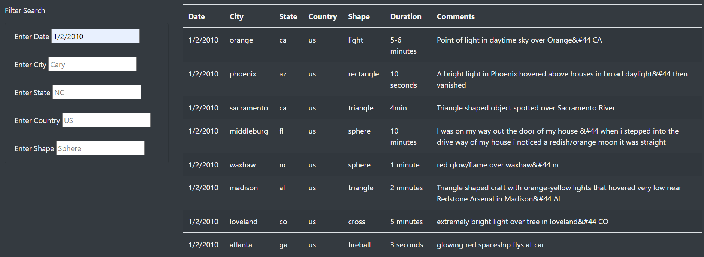

# UFO Sightings with JavaScript

## Overview of Project
The purpose of this project was to expand the functionality of the filtering element that we created with Dana for her websight to track UFO sightings. We were tasked with creating an element using JavaScript that would allow users to filter for multiple criteria at the same time. We were asked to add table filters for the city, state and country of the sighting as well as the shape of the UFO being spotted.

## Results
We had already done a bulk of the work throughout the week and only needed to refactor the JavaScript file to allow users to filter sightings based on multiple filter field inputs and alter the index.html file to accept the results of the new JavaScript functions.

A user would be able to filter the sightings by typing the criteria into one or more of the input fields for either date, city, state, country and/or shape of the UFO. After entering the criteria into the field, the results populate the table automatcally and instantaneously without the cick of a button. If a user would like to clear the results, they could either refresh the page or click on the "UFO Sightings" text at the upper left corener of the page.

## Summary
For the most part, this project was a major success. The website looks beautiful and functions properly. However, the filter element has some drawbacks. If the criteria does not match any of the items in the data set, the table will be blank. This could occur based on spelling, characters being capitalized or there are no objects that match the filter. There could be some simple improvements made to increase functionality and the overall user experience:
    - The list of criteria could be in a dropdown list or autopopulate as the user types in the field
    - There could be a message that appears if there are no results after the criteria has been add, either as a pop up or in the table itself
    - We could use regular expressions to account for capitilized words and simple spelling errors
